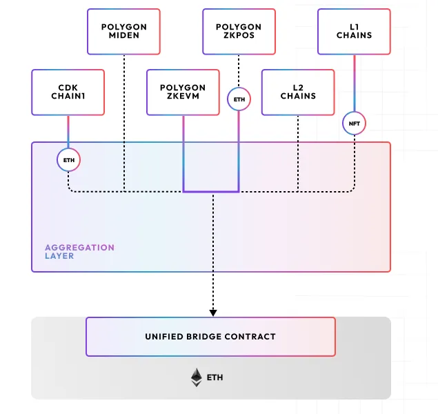

<div id="top"></div>
<!-- PROJECT LOGO -->
<br />
<div align="center">

  
  

<br />

<h1>Agglayer provers</h1>

<p align="center">
The <b>Agglayer</b> (<i>Aggregation layer</i>) provides a common language for secure, atomic, interoperability among heterogeneous chains. (WIP)
</p>
</div>

<br />

<div align="center">

[](https://github.com/agglayer/provers/releases)
[](https://github.com/agglayer/agglayer/actions/workflows/test.yml)
[](https://github.com/agglayer/agglayer/actions/workflows/quality.yml)
[](https://codecov.io/gh/agglayer/agglayer)

<hr />



</div>

## Table of Contents

- [Overview](#overview)
- [Repository Structure](#repository-structure)
- [Prerequisites](#prerequisites)
  - [Succinct Prover Network](#succinct-prover-network)
  - [Software Requirements](#software-requirements)
  - [Hardware Requirements](#hardware-recommendations)
- [Installation](#installation)
- [Modifying and building the Aggchain Proof](#modifying-and-building-the-aggchain-proof)
- [Development](#development)
- [Support](#support)
- [Resources](#resources)
- [License](#license)

## Overview

Agglayer is the Rust-based service designed to: 
1. Receive updates from Agglayer-connected chains 
2. Verify their validity 
3. Send them to the L1 for final settlement. 

To find out more about Agglayer, please visit [the more detailed documentation.](https://docs.polygon.technology/agglayer/overview/)

> [!WARNING]
>    - Some of the content in this section discusses technology in development and not ready for release. As such, all APIs and configuration are subject to change. The code is still being audited, so please contact the Polygon team if you would like to use it in production.

## Repository Structure

The crates and their functions within the Agglayer repo are as follows:

TODO

## Prerequisites

Before working with the repository, you’ll need the following:

### Succinct Prover Network

You’ll need to submit a unique Ethereum address to Succinct for access to their proving network. To get access:

1. Follow the instructions [here](https://docs.succinct.xyz/docs/generating-proofs/prover-network/key-setup) to use Foundry to generate a new private key or retrieve an existing one.
2. Apply for access for the public address associated with your private key to Succinct Network [here](https://docs.google.com/forms/d/e/1FAIpQLSd-X9uH7G0bvXH_kjptnQtNil8L4dumrVPpFE4t8Ci1XT1GaQ/viewform).

### Software Requirements
* [Rustup](https://www.rust-lang.org/tools/install) (stable)
* [protoc](https://grpc.io/docs/protoc-installation/)
* [nextest](https://nexte.st/docs/installation/pre-built-binaries/#with-cargo-binstall)
* [cargo-make](https://github.com/sagiegurari/cargo-make#installation)
* [cargo-insta](https://insta.rs/docs/quickstart/)
* [Go](https://go.dev/doc/install)

### Hardware Recommendations
With SP1, you do not need to generate proofs locally on your machine.

However, if you’d like to run a prover locally (not recommended), you’ll need roughly 40-50GB of available RAM.

## Installation

To install the Agglayer provers repository, please run the following:

```bash
git clone https://github.com/agglayer/provers
cd provers
```

To build Agglayer provers locally, please run:
```bash
cargo build
```

## Running the Test Suite

To execute the test suite, please run the following:

```bash
cargo nextest run --workspace
```

## Modifying and building the Aggchain Proof

By default, the committed pre-compiled ELF binary is used.
Modifications in proof code will not be automatically reflected in the binary.
We use docker-based deterministic build to compile the proof.
Therefore, `docker` has to be present on the system for the build to work if rebuild is enabled.

### Building Aggchain Proof one-off

The following command rebuilds the Aggchain proof and.
It requires `cargo-make` to be installed:

```sh
cargo make ap-elf
```

### Turning on automatic proof rebuild

This option makes the standard commands like `cargo build`, `cargo run` etc. rebuild the proof automatically any time it changes as if it were a normal part of the build.
It is enabled by setting the `AGGLAYER_ELF_BUILD` environment variable to `update`.

```sh
export AGGLAYER_ELF_BUILD=update
```

Note: Rust suppresses the output of build scripts by default.
As a result, the build may appear stuck on the `aggchain-proof-builder` crate while the proof is being rebuilt.

In the `update` mode, the proof will be rebuilt and the cached ELF will be updated.
There is also the `build` mode which leaves the cached ELF intact.
It is mostly useful for debugging, the `update` is more suitable for regular development.

To get automatic rebuilds by default, set the variable in the shell init script.

### Proof versioning policy

The proof binary to use is uniquely identified by a vkey selector on the L1.
The selector is derived from the major version of the `aggchain-proof-program` package.
This version must be bumped between releases / deployments.

## Development

Contributions are very welcomed, the guidelines are currently not available (WIP)

## Support

Feel free to [open an issue](https://github.com/agglayer/agglayer/issues/new) if you have any feature request or bug report.<br />

## Resources
  
## License
Copyright (c) 2024 PT Services DMCC

Licensed under either of

* Apache License, Version 2.0, ([LICENSE-APACHE](LICENSE-APACHE) or http://www.apache.org/licenses/LICENSE-2.0)
* MIT license ([LICENSE-MIT](LICENSE-MIT) or http://opensource.org/licenses/MIT)

at your option. 

The SPDX license identifier for this project is `MIT OR Apache-2.0`.
