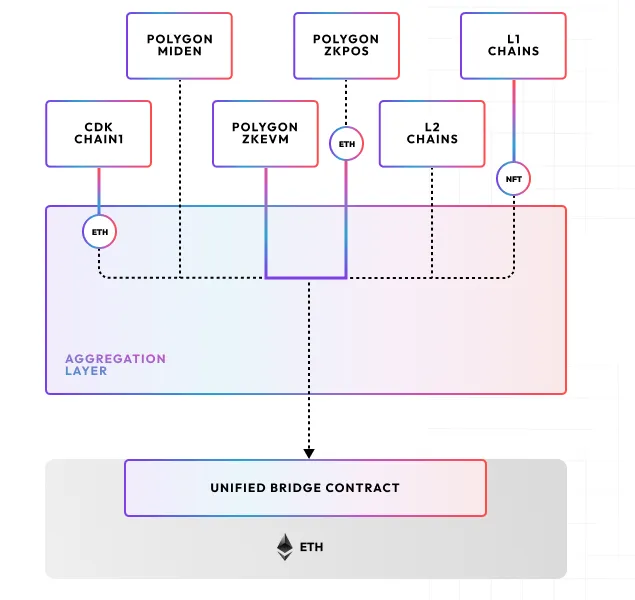

<div id="top"></div>
<!-- PROJECT LOGO -->
<br />
<div align="center">

  
  

<br />

<h1>Agglayer provers</h1>

<p align="center">
The <b>Agglayer</b> (<i>Aggregation layer</i>) provides a common language for secure, atomic, interoperability among heterogeneous chains. (WIP)
</p>
</div>

<br />

<div align="center">

[](https://github.com/agglayer/agglayer/actions/workflows/test.yml)
[](https://github.com/agglayer/agglayer/actions/workflows/quality.yml)
[](https://codecov.io/gh/agglayer/agglayer)

<hr />



</div>

## Table of Contents

- [Table of Contents](#table-of-contents)
- [Overview](#overview)
- [Repository Structure](#repository-structure)
- [Prerequisites](#prerequisites)
  - [Succinct Prover Network](#succinct-prover-network)
  - [Software Requirements](#software-requirements)
  - [Hardware Recommendations](#hardware-recommendations)
- [Installation](#installation)
- [Running the Test Suite](#running-the-test-suite)
- [Modifying and building the Aggchain Proof](#modifying-and-building-the-aggchain-proof)
  - [Building Aggchain Proof one-off](#building-aggchain-proof-one-off)
  - [Turning on automatic proof rebuild](#turning-on-automatic-proof-rebuild)
  - [Check the vkey hash from the ELF binary](#check-the-vkey-hash-from-the-elf-binary)
  - [Proof versioning policy](#proof-versioning-policy)
- [Development](#development)
- [Support](#support)
- [License](#license)

## Overview

Agglayer is the Rust-based service designed to: 
1. Receive updates from Agglayer-connected chains 
2. Verify their validity 
3. Send them to the L1 for final settlement. 

To find out more about Agglayer, please visit [the more detailed documentation.](https://docs.polygon.technology/agglayer/overview/)

> [!WARNING]
>    - Some of the content in this section discusses technology in development and not ready for release. As such, all APIs and configuration are subject to change. The code is still being audited, so please contact the Polygon team if you would like to use it in production.

## Repository Structure

The crates and their functions within the Agglayer repo are as follows:

TODO

## Prerequisites

Before working with the repository, you’ll need the following:

### Succinct Prover Network

You’ll need to submit a unique Ethereum address to Succinct for access to their proving network. To get access:

1. Follow the instructions [here](https://docs.succinct.xyz/docs/generating-proofs/prover-network/key-setup) to use Foundry to generate a new private key or retrieve an existing one.
2. Apply for access for the public address associated with your private key to Succinct Network [here](https://docs.google.com/forms/d/e/1FAIpQLSd-X9uH7G0bvXH_kjptnQtNil8L4dumrVPpFE4t8Ci1XT1GaQ/viewform).

### Software Requirements
* [Rustup](https://www.rust-lang.org/tools/install) (stable)
* [protoc](https://grpc.io/docs/protoc-installation/)
* [nextest](https://nexte.st/docs/installation/pre-built-binaries/#with-cargo-binstall)
* [cargo-make](https://github.com/sagiegurari/cargo-make#installation)
* [cargo-insta](https://insta.rs/docs/quickstart/)
* [Go](https://go.dev/doc/install)

### Hardware Recommendations
With SP1, you do not need to generate proofs locally on your machine.

However, if you’d like to run a prover locally (not recommended), you’ll need roughly 40-50GB of available RAM.

## Installation

To install the Agglayer provers repository, please run the following:

```bash
git clone https://github.com/agglayer/provers
cd provers
```

To build Agglayer provers locally, please run:
```bash
cargo build
```

## Running the Test Suite

To execute the test suite, please run the following:

```bash
cargo nextest run --workspace
```

## Modifying and building the Aggchain Proof

By default, the committed pre-compiled ELF binary is used.
Modifications in proof code will not be automatically reflected in the binary.
We use docker-based deterministic build to compile the proof.
Therefore, `docker` has to be present on the system for the build to work if rebuild is enabled.

### Building Aggchain Proof one-off

The following command rebuilds the Aggchain proof and.
It requires `cargo-make` to be installed:

```sh
cargo make ap-elf
```

### Turning on automatic proof rebuild

This option makes the standard commands like `cargo build`, `cargo run` etc. rebuild the proof automatically any time it changes as if it were a normal part of the build.
It is enabled by setting the `AGGLAYER_ELF_BUILD` environment variable to `update`.

```sh
export AGGLAYER_ELF_BUILD=update
```

Note: Rust suppresses the output of build scripts by default.
As a result, the build may appear stuck on the `aggchain-proof-builder` crate while the proof is being rebuilt.

In the `update` mode, the proof will be rebuilt and the cached ELF will be updated.
There is also the `build` mode which leaves the cached ELF intact.
It is mostly useful for debugging, the `update` is more suitable for regular development.

To get automatic rebuilds by default, set the variable in the shell init script.

### Check the vkey hash from the ELF binary

This command helps to retrieve the vkey hash from a given ELF binary:

```
cargo prove vkey --elf <path-to-elf-file>
```

Output example:

```
Verification Key Hash:
0x0077f45ec2258cc98fa879d13a2773190bffb9cafb9f428ce3c5718dc768f03e
```

Which ELFs?

- `aggchain proof` ELF binary
  - lives in this present `provers` repository
- `aggregation` and `range` ELF binaries for the op-succinct proofs
  - live in the `op-succinct` dependency repository

### Proof versioning policy

The proof binary to use is uniquely identified by a vkey selector on the L1.
The selector is derived from the major version of the `aggchain-proof-program` package.
This version must be bumped between releases / deployments.

### Aggchain proof modes

`mode` in `[aggchain-proof-service.aggchain-proof-builder]` selects what the prover does with a request:

- `standard` (default): the standard aggchain program is proven. It verifies the FEP (for an optimistic certificate, the trusted sequencer signature) and the bridge constraints.
- `recovery`: after an L2 reorg past a settled output. Nothing is executed: the public values are built from L1 (pre-root of the latest L1 output), the L2 bridge roots and the request, and the noop program is proven over them. op-succinct-proposer is not used.

`primary-prover` says how the program of the mode is proven: `network-prover` or `cpu-prover` give a real SP1 proof, `mock-prover` an SP1 mock proof that only a mock verifier accepts.
The setups in use:

| setup | `mode` | `primary-prover` | `proposer-service.mock` | op-succinct-proposer |
|---|---|---|---|---|
| production | `standard` (default) | `network-prover` | `false` | real proofs |
| kurtosis | `standard` (default) | `mock-prover` | `true` | `OP_SUCCINCT_MOCK=true` |
| recovery | `recovery` | `network-prover` or `cpu-prover` | not read | may be stopped |

A chain in `optimisticMode` needs no mode of its own: the aggsender sends optimistic requests, which every mode serves without calling op-succinct-proposer.

#### Switching to the noop program

`recovery` proves `aggchain-proof-noop-program`, a program that commits its public values without verifying them.
It is a real SP1 proof of an empty program, unrelated to the SP1 mock prover.
The certificate carries the selector `0xFFFF0001` instead of the standard one, and the contract only accepts it with the noop vkey registered in the rollup's own `ownedAggchainVKeys`.
Never register it on the `AgglayerGateway`.

1. Print the vkeys and selectors: `aggkit-prover vkey --noop`, `aggkit-prover vkey-selector --noop`, `aggkit-prover vkey`, `aggkit-prover vkey-selector`.
2. As aggchain manager: `addOwnedAggchainVKey(0xFFFF0001, <noop vkey>)` and `addOwnedAggchainVKey(<standard selector>, <standard vkey>)`, then `disableUseDefaultVkeysFlag()`. Owning the standard vkey keeps in-flight certificates and the way back working.
3. Set `mode`, restart the prover.
4. A certificate already InError keeps the aggchain proof the aggsender cached for it: drop that proof (resync the aggsender database) if needed.

To switch back, set `mode = "standard"` and restart the prover. `enableUseDefaultVkeysFlag()` then follows the gateway defaults again.

#### Recovering a halted FEP chain (`recovery`)

When the L2 reorgs past an output already settled on L1, the `AggchainFEP` contract keeps hashing the orphaned output root as the pre-root while the prover proves from the live L2 pre-root, and every certificate fails on the agglayer with `Aggchain hash mismatch`.
Settled outputs cannot be rewritten, so the way out is one certificate whose pre-root is the L1 one.
Bridge constraints are not verified in this mode, so this is for non-production chains only.

1. Check that the local exit root on L2 at the last settled block matches the one on L1. If not, reconcile it first with the bridge `BackwardLET` / `ForwardLET` tooling.
2. Switch to `mode = "recovery"` as above. op-succinct-proposer can be stopped.
3. Once the certificate is settled, switch back to `mode = "standard"`.

With `mode = "recovery"` the prover refuses a request that is not anchored at the latest L1 output.
It asks nothing from op-succinct-proposer and fetches no L2 state proofs: only the L2 bridge root at both ends of the range, the L2 output at the end block and the L1 contract values, so an L2 node that cannot serve `eth_getProof` at the reorged anchor is not a blocker.

## Development

Contributions are very welcomed, the guidelines are currently not available (WIP)

## Support

Feel free to [open an issue](https://github.com/agglayer/agglayer/issues/new) if you have any feature request or bug report.<br />

## License
Copyright (c) 2024 PT Services DMCC

Licensed under either of

* Apache License, Version 2.0, ([LICENSE-APACHE](LICENSE-APACHE) or http://www.apache.org/licenses/LICENSE-2.0)
* MIT license ([LICENSE-MIT](LICENSE-MIT) or http://opensource.org/licenses/MIT)

at your option.

The SPDX license identifier for this project is `MIT OR Apache-2.0`.
